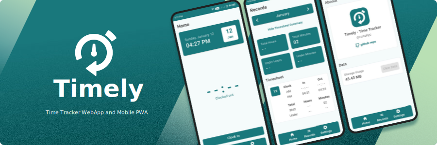
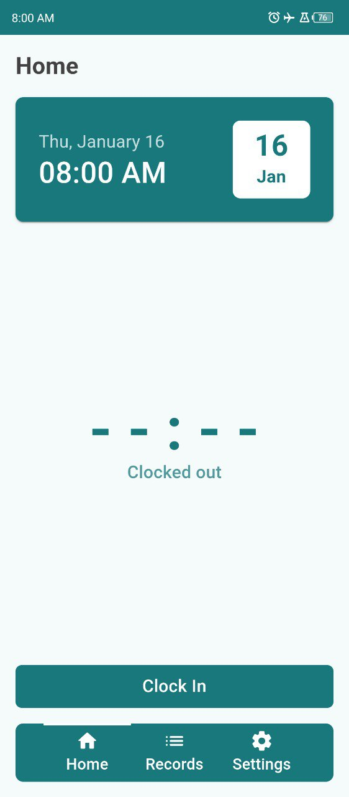

<h2 align="center">Timely - A Time Tracker Mobile Web App (PWA)</h2>

Timely is a mobile-first time tracker with offline PWA support.
Track your work hours and calculate summaries automatically, no internet required
once installed. Everything works offline.

### Features
- Shift time tracker (Track clock-in and clock-out times).
- Monthly timesheet summary (Total hours, minutes, and daily time records)
- All data is saved on the device, we don't upload data anywhere
- Online use (Mobile only site because it's optimized for phone use)
- Offline support (Install as PWA, use offline without an internet connection.)

### Preview

|   |  |
|----------------------------------------|--------------------------------------------|
|  |     |

### To Do
- Prompt Dialogs
- Work hours configuration (To calculate under-time)

### Where to Find

Web Deployment: [Timely on Netlify](https://runtimely.netlify.app)

### License

This project is licensed under the GPLv3 